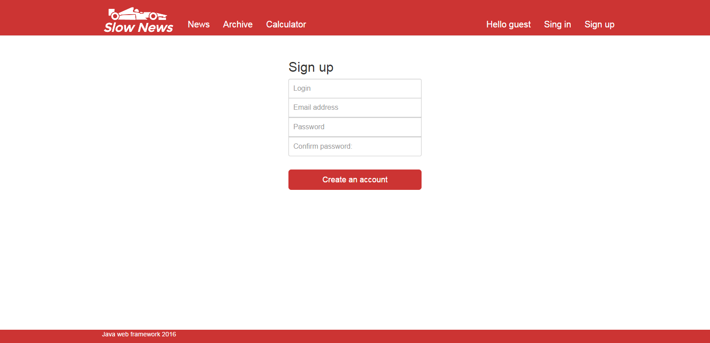

# SlowNews
Training WEB-project on Java EE.

News portal with the ability to register and save the news to the user’s archive.

- back end - Java servlet, JSP, JSTL
- front end - Bootstrap, JavaScript + jQuery, AJAX

***

## Screenshots

